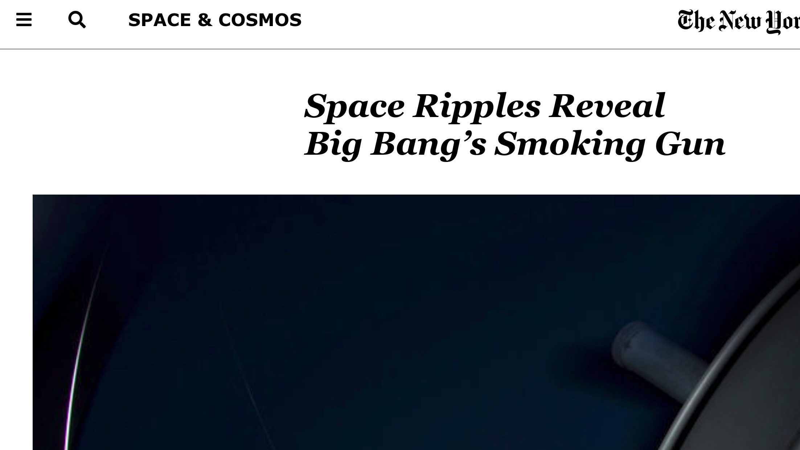

# nyt-clone

> This Project consists of replicating the newyork times article on Space ripples page. The emphasis is on using basic HTML and CSS to style forms



## Live

[Live Link](https://onedebos.github.io/nyt-clone/)

## Built With
- HTML
- CSS

## Getting Started

**To get started, follow the instructions below**

To get a local copy up and running follow these steps.

- git clone this repo

```
git clone https://github.com/onedebos/nyt-clone.git
```

- cd into the folder
- open the index.html file
- run live-server

## Authors

- Adebola Adeniran  [https://github.com/onedebos/]
- Fatima Ahmed [http://github.com/fatymahmed]

## 🤝 Contributing

Contributions, issues and feature requests are welcome!

Feel free to check the [issues page](issues/).

## Show your support

Give a ⭐️ if you like this project!

## 📝 License

This project is [MIT](lic.url) licensed.
